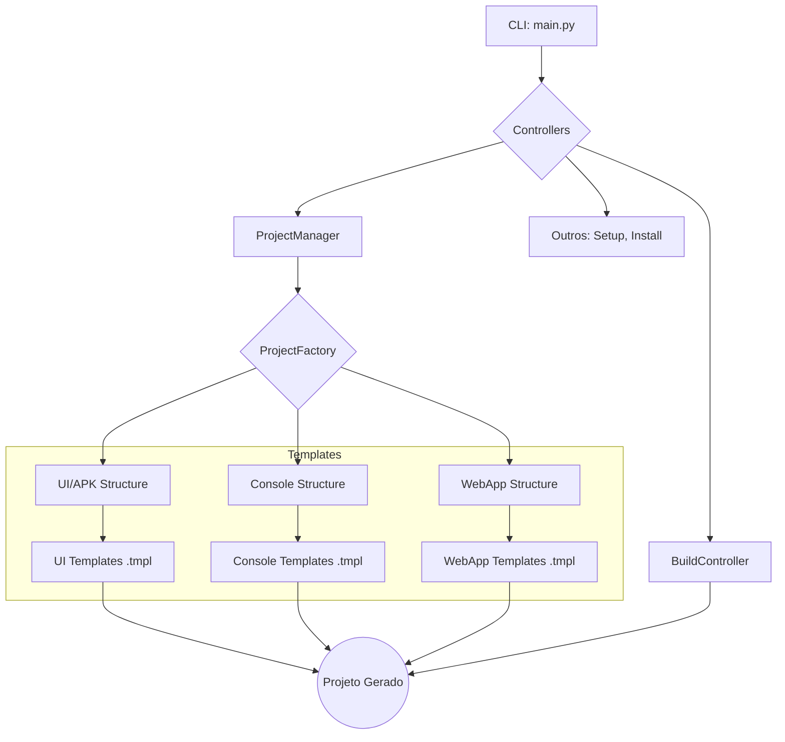

<p align="center">
  <b> 📱 T.A.M.K — Termux APK Manager Kit (v2026) </b>
  
  
  
  
</p>

---

## 📝 Descrição

O **T.A.M.K (Termux APK Manager Kit)** é um framework de automação profissional para o desenvolvimento nativo de aplicativos Android diretamente no ambiente Termux. Projetado para desenvolvedores que buscam total independência de hardware, ele permite criar, compilar, assinar e instalar aplicativos APK, incluindo **WebApps Híbridos**, utilizando apenas um dispositivo móvel.

Na sua nova versão, o T.A.M.K introduz o suporte a **WebApps**, permitindo que desenvolvedores web possam encapsular seus projetos (HTML, CSS, JavaScript) em um APK nativo, pronto para ser distribuído e instalado em dispositivos Android. A solução utiliza um `WebView` configurado para performance e compatibilidade, oferecendo uma ponte robusta entre o mundo web e o ecossistema Android.

## 🚀 Diferenciais Estratégicos

| Funcionalidade | Descrição |
| :--- | :--- |
| **Suporte a WebApps** | Encapsule qualquer aplicação web estática (HTML/CSS/JS) em um APK instalável, com acesso a recursos nativos básicos via JavaScript. |
| **Isolamento de SDK** | Cada projeto gerado contém sua própria cópia do `android.jar`, garantindo portabilidade e prevenindo conflitos de versão. |
| **Template Engine** | Arquitetura modular que separa a lógica Python dos templates de código (XML, Kotlin, HTML), permitindo customização completa sem alterar o núcleo do sistema. |
| **Pipeline de Build Seguro** | Validação de credenciais da Keystore antes do início da compilação, otimizando tempo e evitando falhas em etapas tardias do processo. |
| **Instalação Nativa** | Integração direta com o instalador de pacotes do Android, proporcionando uma experiência fluida desde o desenvolvimento até o teste. |

## 🏗️ Arquitetura do Projeto

A arquitetura do T.A.M.K foi desenhada para ser modular e extensível. A introdução do suporte a WebApps se integra perfeitamente à estrutura existente, adicionando uma nova opção ao `ProjectFactory`.



## ⚙️ Instalação e Configuração

### Pré-requisitos

Certifique-se de que seu ambiente Termux está atualizado e com os pacotes essenciais instalados:

```bash
pkg update && pkg upgrade
pkg install -y python openjdk-21 kotlin wget zip apksigner aapt2 termux-tools
```

### Instalação do Kit

Utilize o script de instalação para configurar o T.A.M.K e tornar o comando `tamk` globalmente acessível:

```bash
# Clone o repositório
git clone https://github.com/seu-usuario/tamk.git
cd tamk

# Execute o instalador
bash setup-install.sh
```

Após a instalação, verifique se o comando foi registrado com sucesso:

```bash
tamk --version
```

## 📖 Guia de Uso (CLI)

Para documentação completa, consulte a pasta `documentation/`.

### Guia Rápido

Consulte [`documentation/QUICKSTART.md`](documentation/QUICKSTART.md) para um guia passo a passo.

### Documentação Completa

| Documento | Descrição |
| :--- | :--- |
| [`ARCHITECTURE.md`](documentation/ARCHITECTURE.md) | Visão geral da arquitetura e fluxo de dados. |
| [`API_COMPONENTS.md`](documentation/API_COMPONENTS.md) | Referência de classes, módulos e templates. |
| [`DEV_GUIDE.md`](documentation/DEV_GUIDE.md) | Guia de desenvolvimento, customização e debugging. |
| [`STRUCTURE.md`](documentation/STRUCTURE.md) | Mapeamento completo da estrutura de diretórios. |
| [`FAQ.md`](documentation/FAQ.md) | Perguntas frequentes sobre o T.A.M.K e WebApps. |
| [`CHANGELOG.md`](documentation/CHANGELOG.md) | Histórico de mudanças e novas funcionalidades. |
| [`CONTRIBUTING.md`](documentation/CONTRIBUTING.md) | Guia de contribuição para desenvolvedores. |

---

<div align="center">
  <sub>Feito com ❤️ pela Comunidade de Desenvolvedores Termux.</sub>
</div>
