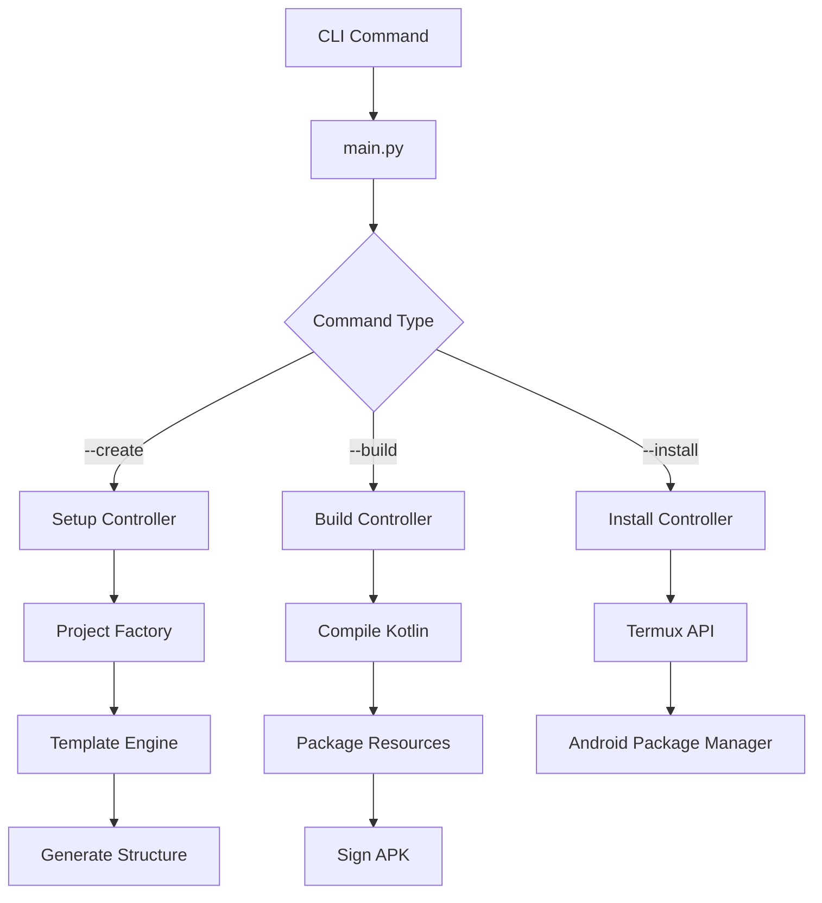

🏗️ Estrutura do Projeto T.A.M.K

```
tamk/
│
├── 📁 assets/                    # Recursos estáticos e templates
│   └── 📁 templates/            # Sistema de templates para geração de projetos
│       └── 📁 ui_apk/          # Template base para aplicativos Android com UI
│           ├── 📄 AndroidManifest.xml.tmpl    # Manifest do Android com placeholders
│           ├── 📄 MainActivity.kt.tmpl        # Template da Activity principal
│           ├── 📄 activity_main.xml.tmpl      # Layout XML da interface
│           ├── 📄 strings.xml.tmpl            # Recursos de strings internacionalizáveis
│           ├── 📄 styles.xml.tmpl             # Estilos e temas Material Design
│           └── 📄 icon.xml.tmpl               # Ícone vetorial do aplicativo
│
├── 📁 src/                      # Código-fonte principal do sistema
│   ├── 📄 main.py              # Ponto de entrada da CLI - orquestração principal
│   │
│   ├── 📁 config/              # Configurações e constantes do sistema
│   │   └── 📄 tamk_config.py   # Configurações globais, versões e paths
│   │
│   ├── 📁 controllers/         # Controladores - lógica de negócio principal
│   │   ├── 📄 setup_controller.py    # Configuração inicial e download de SDK
│   │   ├── 📄 build_controller.py    # Compilação, assinatura e build do APK
│   │   ├── 📄 install_controller.py  # Instalação no dispositivo Android
│   │   ├── 📄 run_controller.py      # Execução e monitoramento do app
│   │   └── 📄 project_manager.py     # Gerenciamento do ciclo de vida dos projetos
│   │
│   ├── 📁 organization/        # Fábrica e estruturas de organização de projetos
│   │   ├── 📄 factory.py             # Fábrica de projetos - cria estrutura base
│   │   └── 📁 structures/            # Blueprints de diferentes tipos de projeto
│   │       ├── 📄 ui_apk.py          # Estrutura para app Android com interface
│   │       └── 📄 console.py         # Estrutura para app de linha de comando
│   │
│   └── 📁 utils/               # Utilitários e helpers do sistema
│       ├── 📄 logger.py        # Sistema de logging unificado com cores
│       ├── 📄 colors.py        # Códigos ANSI para colorização no terminal
│       └── 📄 commands.py      # Wrappers para execução de comandos shell
│
├── 📄 README.md                # Documentação principal do projeto
├── 📄 CONTRIBUTING.md          # Guia para contribuidores
└── 📄 STRUCTURE.md             # Este arquivo - documentação da estrutura
```

📋 Descrição Detalhada dos Componentes

📁 assets/ - Recursos Estáticos

Propósito: Armazenar templates e recursos que não mudam com a execução.

· templates/ui_apk/: Template base para aplicativos Android com interface gráfica
  · .tmpl extensão: Indica arquivo template com placeholders {{VARIÁVEL}}
  · Separação lógica: Mantém código Kotlin, XML e recursos em arquivos distintos
  · Customizável: Desenvolvedores podem modificar sem alterar o núcleo do sistema

📁 src/ - Código-fonte Principal

Propósito: Conter toda a lógica do sistema T.A.M.K.

📄 main.py - Ponto de Entrada

· Função: Orquestrador principal da CLI
· Responsabilidades:
  · Parse de argumentos de linha de comando
  · Roteamento para controllers apropriados
  · Tratamento global de exceções
  · Interface de usuário da linha de comando

📁 config/ - Configuração do Sistema

· tamk_config.py: Centraliza todas as configurações
  · Versões do SDK suportadas
  · URLs de download oficiais
  · Constantes de caminhos padrão
  · Configurações de compilação

📁 controllers/ - Lógica de Negócio

Padrão: Cada controller tem uma responsabilidade única

1. setup_controller.py
   · Configuração inicial do ambiente
   · Download e validação do Android SDK
   · Criação de keystores criptografados
   · Verificação de dependências do sistema
2. build_controller.py
   · Pipeline completo de compilação
   · Compilação Kotlin → Dalvik bytecode
   · Empacotamento de recursos (AAPT2)
   · Assinatura digital com APKSigner
   · Otimização e alinhamento do APK
3. install_controller.py
   · Interface com sistema Android
   · Comunicação via Termux API
   · Instalação silenciosa de APKs
   · Verificação de permissões
4. run_controller.py
   · Execução do aplicativo instalado
   · Monitoramento de logs (logcat)
   · Depuração remota
   · Captura de screenshots
5. project_manager.py
   · Gerenciamento do ciclo de vida
   · Backup e restore de projetos
   · Limpeza de arquivos temporários
   · Metadados do projeto

📁 organization/ - Estrutura de Projetos

Padrão Factory: Cria diferentes tipos de projetos

· factory.py: Fábrica abstrata
  · Interface unificada para criação
  · Validação de parâmetros
  · Injeção de dependências
· structures/ui_apk.py: Estrutura para apps com UI
  ```
  meu_app/
  ├── app/
  │   ├── src/main/
  │   │   ├── AndroidManifest.xml
  │   │   ├── kotlin/.../MainActivity.kt
  │   │   └── res/
  │   │       ├── layout/activity_main.xml
  │   │       ├── values/strings.xml
  │   │       └── values/styles.xml
  │   └── development/
  │       ├── android.jar        # SDK isolada
  │       └── build/            # Arquivos de build
  └── keystore.jks             # Assinatura única
  ```
· structures/console.py: Estrutura para apps CLI
  · Para projetos sem interface gráfica
  · Foco em lógica de negócio pura

📁 utils/ - Utilitários do Sistema

Propósito: Código reutilizável e helpers

1. logger.py - Sistema de Logging
   · Níveis: DEBUG, INFO, WARN, ERROR, CRITICAL
   · Formatação colorida com timestamp
   · Redirecionamento para arquivo
   · Modo verbose para debugging
2. colors.py - Cores ANSI
   · Paleta consistente para toda a CLI
   · Suporte a 256 cores
   · Fallback para sistemas sem suporte
   · Temas claros/escuros
3. commands.py - Execução de Comandos
   · Wrappers seguros para subprocess
   · Timeout e retry automático
   · Captura de stdout/stderr
   · Validação de códigos de saída

📄 Documentação

1. README.md - Primeiro contato
   · Visão geral do projeto
   · Instalação e uso rápido
   · Exemplos práticos
   · Badges e status
2. CONTRIBUTING.md - Para desenvolvedores
   · Guia de contribuição
   · Padrões de código
   · Processo de PR
   · Ambiente de desenvolvimento
3. STRUCTURE.md - Para mantenedores
   · Arquitetura detalhada
   · Fluxo de dados
   · Dependências internas
   · Decisões de design

🔄 Fluxo de Dados



🎯 Princípios de Design

1. Separação de Responsabilidades

· Cada arquivo tem um propósito único
· Controllers não acessam sistema de arquivos diretamente
· Templates são puramente de apresentação

2. Portabilidade Total

· Nenhum caminho absoluto
· Dependências auto-contidas
· SDK isolada por projeto

3. Extensibilidade

· Novos templates via assets/templates/
· Novos tipos de projeto via structures/
· Plugins futuros via interface padrão

4. Resiliência

· Validação em cada etapa
· Fallbacks para erros comuns
· Logging detalhado para debugging

📦 Dependências Internas

```
main.py
    → importa todos os controllers
    → importa config.tamk_config
    → importa utils.logger
    
controllers/*
    → importam organization.factory
    → importam utils.commands
    → importam utils.colors
    
organization/*
    → importam assets via caminhos relativos
    → não importam controllers (circular)
    
utils/*
    → independentes entre si
    → não importam outros módulos
```

🔧 Manutenção e Extensão

Adicionar Novo Template

1. Criar pasta em assets/templates/novo_tipo/
2. Adicionar arquivos .tmpl necessários
3. Criar estrutura em organization/structures/novo_tipo.py
4. Registrar na factory em organization/factory.py

Adicionar Nova Funcionalidade

1. Criar controller em src/controllers/
2. Implementar interface consistente
3. Adicionar comando em main.py
4. Documentar em README.md

Modificar Fluxo Existente

1. Analisar dependências no gráfico acima
2. Manter compatibilidade com versões anteriores
3. Atualizar documentação correspondente

---

Última Atualização da Estrutura: $(date +'%Y-%m-%d')
Mantenedor: Alisson/Termux Developer Community
Status: Produção - Estável

Esta estrutura foi projetada para crescimento orgânico enquanto mantém simplicidade. Antes de modificar, considere o princípio da responsabilidade única.